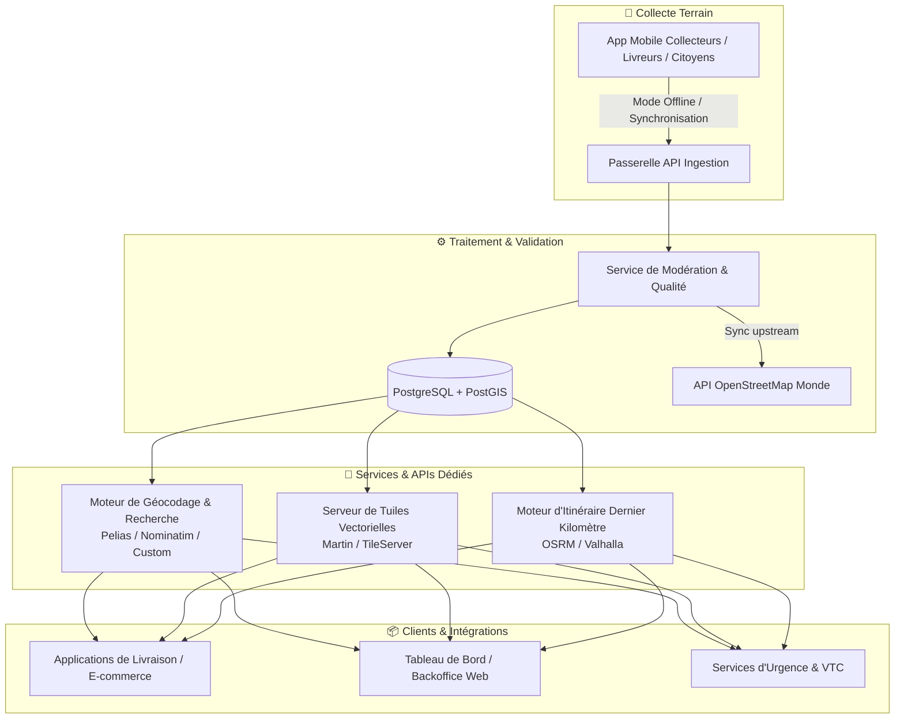

# 🌍 OpenStreetMap Congo (OSM-CG)

> **Plateforme collaborative de cartographie hyper-locale et d'adressage pour la République du Congo (Brazzaville, Pointe-Noire et villes secondaires).**

---

## 📌 1. Vision & Problématique

En République du Congo, les solutions de cartographie propriétaires grand public (telles que Google Maps) souffrent d'un manque critique de données d'adressage et de repères locaux :
- **Absence ou inexactitude des noms de rues** (noms officiels méconnus vs noms vernaculaires/usuels).
- **Inexistence des numéros de parcelles et découpages parcellaires** dans les bases mondiales.
- **Manque de points de repère structurants** (carrefours stratégiques, kiosques, forages, arrêts de bus/taxis, transformateurs, édifices religieux/publics).
- **Réseau routier secondaire et pistes piétonnes non documentés**, impactant la praticabilité (voiture, moto, piéton).

### 🎯 Objectif du projet
Créer une suite d'outils (application mobile de collecte sur le terrain, plateforme de validation et API d'adressage) permettant de :
1. **Recueillir et qualifier la donnée terrain** (noms usuels, numéros de parcelles, points d'intérêt, tracés).
2. **Alimenter l'écosystème OpenStreetMap (OSM)** et une base de données souveraine haute précision.
3. **Fournir une API d'adressage et de géocodage pour les applications de livraison (dernier kilomètre)**, e-commerce, services d'urgence et de logistique.

---

## 🏗️ 2. Architecture Globale du Système



---

## 🛠️ 3. Stack Technique Recommandée

### 📱 Application Mobile (Collecte & Cartographie Terrain)
- **Framework** : [Flutter](https://flutter.dev/) (Multiplateforme Android / iOS, fluidité et gestion native du matériel).
- **Moteur Cartographique** : `flutter_map` (avec tuiles OpenStreetMap / vectorielles) ou `maplibre_gl`.
- **Mode Hors-Ligne** : Cache local via SQLite / Drift ou Hive avec synchronisation différentielle (indispensable pour les zones à faible couverture réseau).
- **Capteurs & Outils** :
  - Géolocalisation GPS haute précision (avec indicateur de précision en mètres).
  - Prise de photo (preuves visuelles pour validation : numéros peints sur les murs, panneaux de rue).
  - Tracé de polygones pour les parcelles et lignes pour les ruelles.

### 🖥️ Backend & Pipeline de Données
- **Base de Données Géospatiale** : **PostgreSQL** avec extension **PostGIS** (gestion des index spatiaux GiST, calculs géodésiques, géocodage inversé).
- **API Backend** : **FastAPI (Python)** ou **Node.js (TypeScript / NestJS)** :
  - CRUD des signalements et contributions.
  - Système de réputation des contributeurs et workflow de modération.
  - Endpoints REST & OpenAPI pour l'intégration tierce.
- **Serveur de Tuiles (Vector Tiles)** : **Martin** (écrit en Rust, ultra-rapide sur PostGIS) ou **TileServer GL**.

### 🔍 Moteurs d'Adressage, Géocodage & Routage
- **Géocodage / Recherche** :
  - **Pelias** ou **Nominatim** configuré avec les données locales du Congo.
  - Algorithme de recherche approximative (*fuzzy search*) pour gérer l'orthographe locale des quartiers et repères.
- **Routage / Calcul d'itinéraires** : **OSRM** (Open Source Routing Machine) ou **Valhalla**, avec profils adaptés aux routes non goudronnées, motos et piétons.

### 🌐 Portail Web & Backoffice de Modération
- **Frontend** : **Next.js** ou **Vue / Nuxt** avec **MapLibre GL JS** / **OpenLayers**.
- **Fonctionnalités** :
  - Validation par la communauté / modérateurs des nouvelles adresses ajoutées.
  - Visualisation des zones blanches cartographiques.
  - Statistiques de complétion par quartier/arrondissement.

---

## 📋 4. Modèle de Données & Standard d'Adressage

Pour être interopérable avec OpenStreetMap tout en répondant aux réalités locales :

| Champ | Type / Tag OSM | Description & Exemple |
| :--- | :--- | :--- |
| **`addr:housenumber`** | `String` | Numéro de parcelle (ex: `12`, `45 Bis`) |
| **`addr:street`** | `String` | Nom de la rue officiel ou usuel (ex: `Rue Mbochis`, `Avenue de la Paix`) |
| **`addr:suburb` / `addr:neighbourhood`** | `String` | Quartier (ex: `Bacongo`, `Poto-Poto`, `Tié-Tié`, `Ouenzé`) |
| **`addr:city`** | `String` | Ville (ex: `Brazzaville`, `Pointe-Noire`, `Dolisie`) |
| **`landmark`** | `String` | Point de repère clé (ex: `Face Pharmacie de l'Union`, `Près du Forage Papa Paul`) |
| **`access:delivery`** | `Array` | Accessibilité (ex: `car`, `motorcycle`, `foot_only`) |
| **`geometry`** | `Point / Polygon` | Coordonnées GPS WGS84 (`lat`, `lng`) ou contour parcellaire |

---

## 🔌 5. API pour les Applications de Livraison (Exemples d'Intégration)

### `GET /api/v1/geocode/search`
Recherche d'une adresse ou d'un repère textuel.
```json
{
  "query": "Parcelle 15 rue kibangou moungali",
  "results": [
    {
      "id": "cg-bz-mou-00124",
      "formatted_address": "Parcelle 15, Rue Kibangou, Moungali, Brazzaville",
      "parcel_number": "15",
      "street": "Rue Kibangou",
      "district": "Moungali (Arrondissement 4)",
      "city": "Brazzaville",
      "location": {
        "lat": -4.24982,
        "lng": 15.27834
      },
      "landmark_hint": "À 50m du Marché Dix Francs",
      "accessibility": ["car", "motorcycle", "foot"]
    }
  ]
}
```

### `GET /api/v1/geocode/reverse`
Obtention de l'adresse et des repères à partir d'un point GPS.

---

## 🚀 6. Feuille de Route (Roadmap)

- [x] **Phase 1 : Conception & Spécifications**
  - [x] Architecture globale et choix des technologies.
  - [x] Définition de la structure de données d'adressage et des tags OSM.
- [ ] **Phase 2 : Socle Backend & Base Spatiale**
  - [ ] Déploiement de PostgreSQL + PostGIS et scripts de migration.
  - [ ] Mise en place de l'API d'ingestion et du moteur de recherche d'adresses.
- [ ] **Phase 3 : Application Mobile MVP (Collecte)**
  - [ ] Interface de saisie rapide (GPS, Nom de rue, Numéro de parcelle, Photo, Repère).
  - [ ] Fonctionnement hors-ligne et mise en file d'attente des envois.
- [ ] **Phase 4 : Portail de Modération & Intégration OSM**
  - [ ] Validation des points par les administrateurs/super-contributeurs.
  - [ ] Passerelle d'export/synchronisation vers OpenStreetMap.
- [ ] **Phase 5 : SDK & API Publique pour Livreurs**
  - [ ] Documentation OpenAPI / Swagger.
  - [ ] Bibliothèque d'intégration rapide pour les applications de livraison partenaires.

---

## 🤝 7. Contribution

Les contributions sont les bienvenues ! Pour toute proposition de standard de nommage ou d'amélioration des outils, ouvrez une *Issue* ou soumettez une *Pull Request*.
